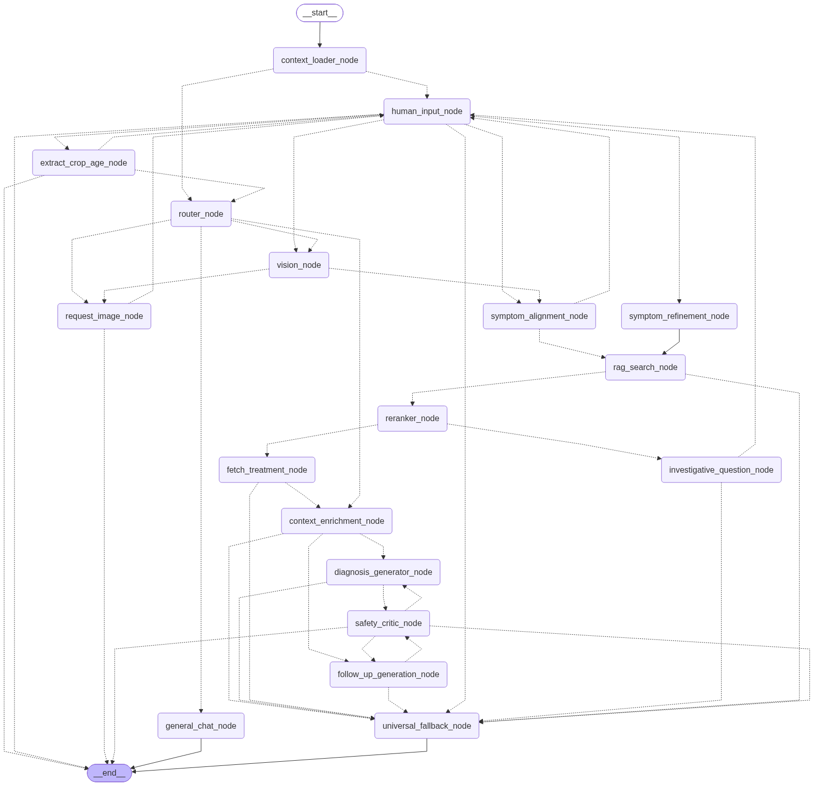

# Livia-AI | Multi-Modal Rice Crop Diagnostic System

A voice-first, multimodal agricultural assistant built to help farmers diagnose crop diseases, verify chemical dosages, and receive localized advisory using their native language.

## 🌾 Overview

Livia-AI addresses the rural accessibility gap by eliminating complex text interfaces. Farmers can provide crop images and spoken descriptions in regional languages (e.g., Kannada). 

Instead of relying on isolated computer vision models, visual diagnostic reasoning is handled natively by a multimodal LLM inside a state-driven LangGraph workflow. The system performs symptom extraction, differential retrieval, weather-aware dosage checks, and safety critique before generating a synthesized audio response.

## ✨ Key Capabilities

* **Voice-First Interaction:** Regional voice capture with automated speech-to-text and native-language audio playback.
* **Multimodal Visual Reasoning:** Uses Google Gemini Multimodal directly inside the agent pipeline for lesion identification and symptom alignment without separate CV models.
* **Agentic Graph Workflow:** LangGraph-powered state engine with dynamic routing, Human-in-the-Loop (HITL) investigative follow-ups, and fallback safety guards.
* **Context & Weather Aware:** Integrates live weather forecasts to evaluate spraying viability and prevent crop damage.
* **Safety Critic Layer:** Validates dosage safety against the user's previous treatment history, verifies weather suitability, and ensures the recommendation strictly grounds itself in the provided agricultural data.

## 🤖 AI & Technology Stack

* **Workflow Orchestrator:** LangGraph (StateGraph multi-agent routing)
* **Reasoning & Vision Engine:** Google Gemini (Multimodal LLM)
* **Speech-to-Text (STT):** Sarvam AI (Regional Indian language transcription)
* **Text-to-Speech (TTS):** Edge-TTS (Regional audio synthesis)
* **Backend Framework:** FastAPI (Python, asynchronous runtime)
* **Database & Persistence:** Supabase (PostgreSQL with pgvector for RAG embeddings, session logs, and Storage buckets for media)
* **External Services:** OpenWeatherMap API

## 📁 Repository Structure

```text
Livia-AI/
├── backend/
│   ├── ai_core/
│   │   ├── chains/
│   │   ├── nodes/
│   │   ├── system_prompts/
│   │   ├── utils/
│   │   ├── constants.py
│   │   ├── edges.py
│   │   ├── graph.py
│   │   ├── llm_config.py
│   │   └── state.py
│   ├── api/
│   ├── config/
│   ├── database/
│   ├── schemas/
│   ├── scripts/
│   ├── services/
│   ├── .env.example
│   ├── .python-version
│   ├── graph.png
│   ├── main.py
│   ├── pyproject.toml
│   └── uv.lock
└── .gitignore

```

## Diagnostic Workflow Graph

The backend decision pipeline is structured as an executable cyclic graph (`StateGraph`):



### Execution Pipeline

* **Context Loading & Routing:** Session state is initialized via `context_loader_node`. Queries are routed based on visual presence and intent.
* **Vision & Alignment:** `vision_node` extracts visual lesion features, which are aligned with the transcribed spoken symptoms in `symptom_alignment_node`.
* **Retrieval & Reranking:** Candidate diseases are fetched from the knowledge base and ranked. If ambiguity exists, `investigative_question_node` triggers a clarification loop.
* **Treatment & Environmental Context:** Treatments are fetched and cross-referenced with real-time temperature, humidity, and rain forecasts.
* **Safety Validation:** `safety_critic_node` acts as a gatekeeper to verify that the advice aligns with past application history, current weather conditions, and remains strictly grounded in the retrieved dataset.
## ⚙️ Running Locally (Backend)

### Prerequisites

* Python 3.10+
* `uv` package manager installed

### 1. Clone the repository

```bash
git clone [https://github.com/poojary-nikesh1612/Livia-AI.git](https://github.com/poojary-nikesh1612/Livia-AI.git)
cd Livia-AI/backend
```
### 2. Environment Setup

Create a `.env` file based on `.env.example`:

```bash
cp .env.example .env
```

Populate the required environment keys:

```env
GEMINI_API_KEY=your_gemini_api_key
SARVAM_API_KEY=your_sarvam_api_key
SUPABASE_URL=your_supabase_url
SUPABASE_KEY=your_supabase_service_role_key
```

### 3. Install Dependencies & Run

Using `uv`:

```bash
uv sync
uv run uvicorn main:app --reload --port 8000
```

The API will be live at `http://127.0.0.1:8000`.
